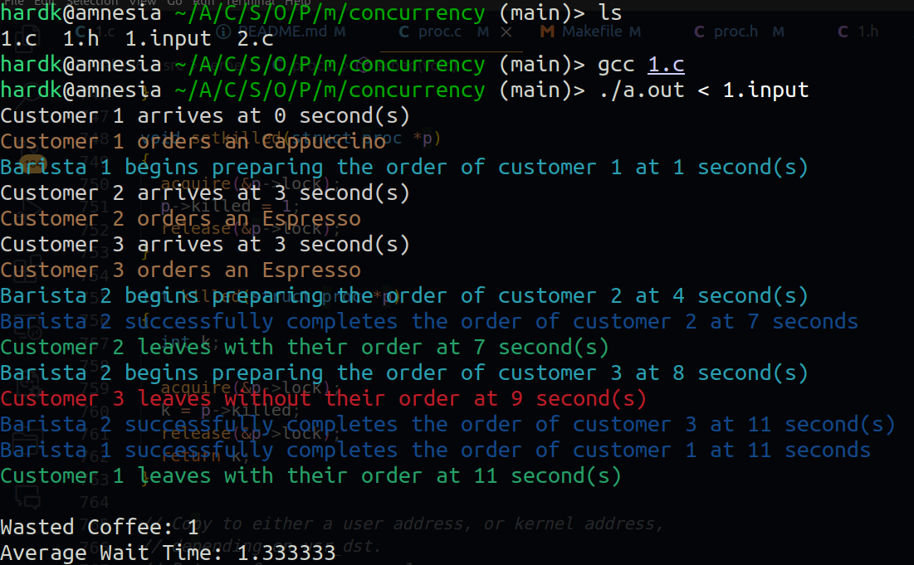

# OSN Mini Project 3


## PBS Scheduling in XV6
Preemptive Priority-Based Scheduling (PBS) is a type of scheduling algorithm commonly used in real-time operating systems where tasks are assigned priorities, and the scheduler selects tasks for execution based on these priorities. In this approach, a currently running task can be preempted (interrupted) if a higher-priority task becomes ready to run, ensuring that the most critical tasks receive processor time first. This method is beneficial in systems where tasks have varying levels of importance and response time requirements. The preemptive nature allows for more responsive handling of high-priority tasks at the cost of potentially greater context-switching overhead, compared to non-preemptive scheduling.

This method helps as
* **Responsive to High-Priority Tasks**: This method allows the operating system to immediately allocate CPU time to high-priority tasks as soon as they become ready to run. This responsiveness is crucial in real-time systems where timely execution of critical tasks is paramount, ensuring that urgent processes are attended to promptly.

* **Efficient Resource Utilization**: By allowing higher-priority tasks to preempt lower-priority ones, PBS ensures that the CPU is not idly waiting while high-priority tasks are ready to run. This leads to more efficient use of processor time, as the system can continuously work on the most important tasks available at any given moment.

* **Flexibility and Control**: PBS provides a framework where priorities can be dynamically adjusted, offering flexibility in managing tasks according to their current importance and deadlines. This is particularly useful in complex systems where task priorities may need to change in response to real-time events or system states, allowing the OS to adapt to varying workload conditions effectively.

To implement this, I have made the following changes to the main XV6 architecture

1. Added more variables to the `proc` structure in `proc.h` for the extra parameters required for PBS scheduling

```
  uint SP;           
  uint DP;           
  uint RBI;          
  uint RTime;        
  uint STime;        
  uint WTime;        
  uint start_time;   
  uint numScheduled; 
```
where,

* RTime : The total time the process has been running since it was last scheduled.

* STime : The total time the process has spent sleeping (i.e., blocked and not using CPU time) since it was last scheduled.

* WTime : : The total time the process has spent in the ready queue waiting to be scheduled.

* numScheduled : The number of times, the process has been scheduled before (required to handle if two processes have the same Dynamic Priority)

* SP : The static priority for each process
* DP : The dynamic priority for each process which calculated again and again
* RBI : It measures its recent behavior and is used to adjust its dynamic priority. It is a weighted sum of three factors: Running Time (RTime), Sleeping Time (STime), and Waiting Time (WTime). The default value of RBI is 25.

<br>

2. Functions to calculate the Dynamic Priority and RBI as asked in the question in `proc.c`

where RBI is

$$RBI = \max \left( \left\lfloor \frac{3 \times \text{RTime} - \text{STime} - \text{WTime}}{\text{RTime} + \text{WTime} + \text{STime} + 1} \times 50 \right\rfloor, 0 \right)$$

$$DP = \min(\text{SP} + \text{RBI}, 100)$$

```
int calculate_rbi(struct proc *p)
{
  if (!p)
    return 0; // Safety check

  int numerator = 3 * p->RTime - p->STime - p->WTime;
  int denominator = p->RTime + p->WTime + p->STime + 1;
  int rbi = numerator / denominator * 50;
  rbi = (int)rbi;
  return rbi > 0 ? rbi : 0; // Ensure RBI is non-negative
}

void update_dp(struct proc *p)
{
  p->RBI = calculate_rbi(p);
  int temp = p->SP + p->RBI;
  p->DP = temp < 100 ? temp : 100;
  // printf("meowmeow\n");
  // p->DP = min(p->SP + p->RBI, 100);
}

```


3.  Initialized the above defined variables in the `allocproc(void)` function in `proc.c`
```
  p->RTime = 0; 
  p->WTime = 0; 
  p->STime = 0;
  p->numScheduled = 0;
  p->SP = 50; // Since we have been asked to set it to 50 by default
```

4. The main functions for finding the process with the highest priority and scheduling it in `proc.c`
```
void selectHigherPriorityProcess(struct proc **selectedProc, struct proc *currentProc)
{
  acquire(&(*selectedProc)->lock);
  struct proc *oldSelectedProc = *selectedProc;

  // Compare the number of times each process has been scheduled and their creation time.
  if ((*selectedProc)->numScheduled == currentProc->numScheduled)
  {
    // as given in the question we have to sort accordingly if the processes have been scheduled equal number of times
    if ((*selectedProc)->ctime > currentProc->ctime)
    {
      *selectedProc = currentProc;
    }
  }
  else if (currentProc->numScheduled < (*selectedProc)->numScheduled)
  {
    *selectedProc = currentProc;
  }
  // else the current process will be the selected process

  release(&oldSelectedProc->lock);
}
int clampDP(int DP)
{
  // check if the DP of the process should be between 0 and 100
  if (DP > 100)
    return 100;
  if (DP < 0)
    return 0;
  return DP;
}
void scheduleProcess(struct proc *procToRun, struct cpu *c)
{

  acquire(&procToRun->lock);
  if (procToRun->state == RUNNABLE)
  {
    int startTime = ticks;
    c->proc = procToRun; // to be run now
    procToRun->RTime = procToRun->STime = 0; // since now we want to keep them from 0 again (unlike the main proc vars)
    procToRun->numScheduled++; // since it is going to be scheduled
    procToRun->state = RUNNING;

    swtch(&c->context, &procToRun->context); // changing the context for the process

    // Update running time and dynamic priority.
    procToRun->RTime = ticks - startTime; // updated the RTime for the selected process
    update_dp(procToRun); // update the Dynamic Probablity
    procToRun->SP = clampDP(procToRun->DP); // making the static prob same as the dynamic prob
    c->proc = 0; // 
  }
  release(&procToRun->lock);
}
```

5. Changes in the `scheduler()` function in `proc.c` to use these functions
```
#ifdef PBS
  printf("Using PBS\n");
  for (;;)
  {
    struct proc *p;
    struct cpu *c = mycpu();
    c->proc = 0;
    intr_on(); // Enable interrupts to avoid deadlock.

    int lowestPriority = 9999999;     // Initialize with the highest priority value.
    struct proc *selectedProc = 0; // This will hold the process with the highest priority.

    // Iterate over all processes to find the one with the highest priority.
    for (p = proc; p < &proc[NPROC]; p++)
    {
      acquire(&p->lock);
      if (p->state == RUNNABLE)
      {
        // Check for process with equal priority.
        if (p->SP == lowestPriority)
        {
          // Ensure selectedProc is valid and not the same as the current process.
          if (selectedProc && selectedProc != p)
          {
            selectHigherPriorityProcess(&selectedProc, p);
          }
          else
          {
            selectedProc = p;
          }
        }
        // Check for a process with higher priority.
        else if (lowestPriority > p->SP)
        {
          lowestPriority = p->SP;
          selectedProc = p;
        }
      }
      release(&p->lock);
    }

    // Schedule the selected process.
    if (selectedProc) // check if it is legit
    {
      scheduleProcess(selectedProc, c);
    }
#endif
  }
```

6. A fucntion as a system call to set the priority manually of a process in `sysproc.c` and a function to call this systemcall in `setpriority.c` (which was made manually) in `users/` folder, along with adding this new file and function in `user.h`, `usys.pl`, `schedulertest.c` etc.
```
uint64 sys_setpriority(void)
{
  int pid, new_priority;
  argint(0, &pid);
  argint(1, &new_priority);
  if (new_priority < 0 || new_priority > 100)
    return -1;

  struct proc *p;
  int old_priority = 999999999; // assuming the best priority is the one which is the least

  for (p = proc; p < &proc[NPROC]; p++)
  {
    if (p->pid == pid)
    {
      acquire(&p->lock);

      old_priority = p->SP;
      p->SP = new_priority;
      p->RBI = 25;  // Reset RBI
      update_dp(p); // Update DP based on new SP and RBI
      release(&p->lock);
      break;
    }
  }

  if (old_priority != -1 && new_priority < old_priority)
  {
    yield(); // Trigger rescheduling if priority is increased
  }

  return old_priority;
}
```

```
#include "kernel/types.h"
#include "kernel/stat.h"
#include "user.h"

int main(int argc, char *argv[])
{
    if (argc != 3)
    {
        printf("Usage: setpriority pid priority\n");
        exit(1);
    }
    int priority = atoi(argv[1]);
    int pid = atoi(argv[2]);
    if (setpriority(priority, pid) < 0)
    {
        printf("setpriority failed\n");
        exit(1);
    }
    exit(0);
}
```

7. Updated the new variables accordingly in `proc.c`
```
void update__proc_stats(struct proc *p)
{
  acquire(&p->lock);
  if (p->state == RUNNING)
  {
    p->RTime++;
    p->rtime++;
  }
  if (p->state == RUNNABLE)
  {
    p->WTime++;
  }
  if (p->state == SLEEPING)
  {
    p->STime++;
  }
  release(&p->lock);
}
```

### Results of the PBS Scheduler
* For 1 CPU : Average rtime 13,  wtime 127
* For 3 CPUs : Average rtime 8,  wtime 110

<br>
<br>
<br>

## CoW functionality
Copy-On-Write is a strategy where system processes are given a shared copy of a resource (like memory) instead of each having their own copy. Initially, they all reference the same physical memory location.

This approach saves memory because the same data is not duplicated across multiple processes. As long as the data is not modified, all processes share the same resource.

Writing Operations: When a process needs to modify this shared resource, the operating system intervenes. Instead of altering the shared resource, the system creates a separate copy of the data for that specific process. This is the "write" part of Copy-On-Write.

**To implement this in XV6, I have made the following changes**

1. Made a new struct in `kalloc.c` which counts the number of refs to a page that the cowpies have

Example,
* for a page with no cowpy, count is 0. Number of programs that can access it is 1
* for a page with 4 cowpies, count is 4. Number of programs that can access it is 5

```
struct
{
  struct spinlock lock;
  uint64 count;
} pg_cowrefs[PHYSTOP / PGSIZE];
```

2. Implemented a main `uvmcopy()` function and a function to duplicate the page `dup_pg` in `kalloc.c` and added their function definitions in `def.h`

```
int cowmappage(pagetable_t pagetable, uint64 va, uint64 size, uint64 pa, int perm)
{
  // Validate the physical address (pa).
  if (((uint64)pa % PGSIZE) != 0 || (char *)pa < end || (uint64)pa >= PHYSTOP)
    panic("cowmappage: invalid physical address");

  // Calculate the index for the page in the pg_cowrefs array.
  int pageIndex = pa / PGSIZE;

  // Acquire the lock for the page's reference count.
  acquire(&pg_cowrefs[pageIndex].lock);

  // Map the page and check the result.
  int mappingResult = mappages(pagetable, va, size, pa, perm | PTE_COW);

  // If mapping is successful, increment the page reference counter.
  if (mappingResult == 0)
    pg_cowrefs[pageIndex].count++;

  // Release the lock.
  release(&pg_cowrefs[pageIndex].lock);

  return mappingResult;
}

int dup_pg(pagetable_t pt, uint64 va)
{
  // Validate the virtual address (va).
  if (va >= MAXVA || va == 0)
    return -1;

  // Walk the page table to find the page table entry for va.
  pte_t *pte;
  if ((pte = walk(pt, va, 0)) == 0)
    return -1;

  // Check if the page is a COW page and accessible to the user.
  if ((*pte & PTE_COW) == 0)
    return 0; // not a cow'd addr

  // check if the page is accessible to the user
  if ((*pte & PTE_U) == 0)
    return -1; // not accessible to user

  // check if the page is valid
  if ((*pte & PTE_V) == 0)
    return -1; // not a valid page

  uint64 oldpa = PTE2PA(*pte);     // old physical address
  uint64 newpa = (uint64)kalloc(); // new physical address

  if (newpa == 0)
    return -2;
  memmove((void *)newpa, (void *)oldpa, PGSIZE);

  *pte = PA2PTE(newpa) | PTE_U | PTE_V | PTE_W | PTE_X | PTE_R;
  *pte &= ~PTE_COW;

  kfree((void *)oldpa);

  return 0;
}


```

3. Defined a Page Table Entry for CoW in `riscv.h`
```
#define PTE_COW (1L << 8) // for CoW fork
```

4. Modified the `kinit()`, `freerange()`, `kfree()` functions in `kalloc.c` 

5. Changed the line in `proc.c` which makes childs of parents to call `uvmcowpy()` instead of `uvmcopy()`

<br>
<br>
<br>

## Concurrency

Assumption : The waiting time I have calculated is till when the barista got free (did not include +1 when the coffee starts getting prepared)

### Results


**Question** : If there would be infinite barista, then what would be the avg wait time for the shop?

**Answers** : For my implementation, it would be **0** as per my assumption of wating time equals till when the customer gets a free barista and not when his coffee starts getting made. If it would till when their starts making, then it would be **1**.


## DECLARATION
I have used AI tools to help me in writing code but I have full understanding of the working all the code above.