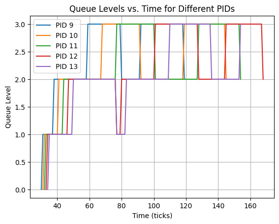

# Enhancing XV6 & Networking Basics

## ReadCount

- Declared `int readcount` in `src/kernel/proc.h` at line 102 to be used in `proc.c`.

<br>

- Initialized `readcount = 0` in `src/kernel/proc.c` at line 129 which is a global variable that keeps track of the number of times `read` has been called.

  ```
  p->readcount = 0;
  ```

<br>

- Initialized `count_read` to `0` in `src/kernel/sysproc.c` at line 10 which is a global variable that keeps track of the number of times `read` has been called.

  ```
  int count_read = 0;
  ```

<br>

- Defined the systemcall number of `SYS_getreadcount` in `src/kernel/syscall.h` to `23` at line 24

  ```
  #define SYS_getreadcount 23
  ```

<br>

- Added the prototype of `sys_getreadcount` in `src/kernel/syscall.c` at line 103.
  ```
  extern uint64 sys_getreadcount(void);
  ```

<br>

- Added the mapping of the number of `SYS_getreadcount` to `sys_getreadcount` in `src/kernel/syscall.c` at line 132.

  ```
  [SYS_getreadcount] sys_getreadcount,
  ```

<br>

- Checked if the `num` is the same as the number of `SYS_read` and if it is then increment the `count_read` by `1` in `src/kernel/syscall.c` at line 145.

  ```
      if (num > 0 && num == SYS_read)
      {
          count_read++;
      }
  ```

<br>

- Checked if the `num` is the same as the number of `SYS_getreadcount` and if it is then change the value `readcount` of the process to the updated value of `count_read` in `src/kernel/syscall.c` at line 150.
  ```
     if (num > 0 && num == SYS_getreadcount)
     {
         p->readcount = count_read;
     }
  ```

<br>

- Added the function prototype of `getreadcount` in `src/user/user.h` at line 26.

  ```
  int getreadcount(void);
  ```

<br>

- Added the entry for `getreadcount` in `src/user/usys.pl` at line 40.

  ```
  entry("getreadcount");
  ```

<br>
<br>


## SIGALARM AND SIGRETURN

- Declared the following in `src/kernel/proc.h` at line numbers `105` to `109` :
  ```
  int signal_state;
  uint64 signal_handler;
  int interval;
  int num_ticks;
  struct trapframe \*alarm_trapf;
  ```

<br>

- Initialized the following in `src/kernel/proc.c` at line numbers `129` to `134` :

  ````
  p-> signal_state = 0; //This is a global variable that keeps track of the state of the signal handler.
  p-> interval = 0; //This is a global variable that keeps track of the interval of the signal handler.
  p-> num_ticks = 0; //This is a global variable that keeps track of the number of ticks of the signal handler.
  p-> signal_handler = 0; //This is a global variable that keeps track of the signal handler.
  p-> alarm_tf = 0;//This is a global variable that keeps track of the trapframe of the signal handler.

      ```

  <br>

  ````

- Defined the systemcall number of `SYS_sigalarm` and `SYS_sigreturn` to `24` and `25` respectively in `src/kernel/syscall.h` at line numbers `25` and `26` respectively.

  ```
  #define SYS_sigalarm 24
  #define SYS_sigreturn 25
  ```

<br>

- Added the prototypes of the functions `sys_sigalarm` and `sys_sigreturn` in `src/kernel/syscall.c` at line numbers `104` and `105` respectively.

  ```
  extern uint64 sys_sigalarm(void);
  extern uint64 sys_sigreturn(void);
  ```

  <br>

- Added the mappings of the numbers of `SYS_sigalarm` and `SYS_sigreturn` to `sys_sigalarm` and `sys_sigreturn` respectively in `src/kernel/syscall.c` at line numbers `133` and `134` respectively.

  ```
  [SYS_sigalarm] sys_sigalarm,
  [SYS_sigreturn] sys_sigreturn,
  ```

<br>

- Added the main code for `sys_sigalarm(void)` in `src/kernel/sysproc.c` at line numbers `19` to `40`.

  ```
  uint64
  sys_sigalarm(void)
  {
    int interval;
    uint64 handler;

    // Get the interval and handler address from the user space.
    argint(0, &interval);
    argaddr(1, &handler);

    struct proc *p = myproc(); // Get the current process

    // Ensure atomic operations to prevent race conditions.
    acquire(&p->lock);

    p->interval = interval;      // Set the interval for the current process
    p->signal_handler = handler; // Set the signal handler for the current process

    release(&p->lock);

    return 0;
  }
  ```

- Added the main code for `sys_sigreturn(void)` in `src/kernel/sysproc.c` at line numbers `42` to `67`.

  ```
  uint64
  sys_sigreturn(void)
  {
    struct proc *p = myproc(); // Get the current process

    // Ensure atomic operations to prevent race conditions.
    acquire(&p->lock);

    // Check if alarm_trapf is not NULL before performing operations.
    if (p->alarm_trapf != 0)
    {
      memmove(p->trapframe, p->alarm_trapf, PGSIZE); // Restore the trapframe of the current process
      kfree(p->alarm_trapf);                         // Free the memory allocated for the alarm_trapf
      p->alarm_trapf = 0;                            // Reset the alarm_trapf
    }

    p->num_ticks = 0;    // Reset the number of ticks
    p->signal_state = 0; // Reset the signal state

    release(&p->lock);

    usertrapret(); // Return to user space

    return 0;
  }
  ```

<br>

- Added the following code to handle the operatoins in `src/kernel/trap.c` at line numbers `86` to `115`

  ```
    // Ensure atomic operations to prevent race conditions.
      acquire(&p->lock);

      if (p->interval > 0 && p->signal_state == 0)
      {
        p->num_ticks++;
        if (p->num_ticks >= p->interval)
        {
          p->num_ticks = 0;
          p->signal_state = 1;

          // Allocate memory for alarm_trapf and check for allocation failure.
          p->alarm_trapf = kalloc();
          if (p->alarm_trapf == 0)
          {
            // Handle memory allocation failure, e.g., log an error or reset signal_state.
            p->signal_state = 0;
          }
          else
          {
            // Ensure memmove is safe, i.e., trapframe and alarm_trapf point to valid memory.
            memmove(p->alarm_trapf, p->trapframe, PGSIZE);

            // Ensure signal_handler points to a valid function before modifying epc.

            p->trapframe->epc = p->signal_handler;
          }
        }
      }

      release(&p->lock);

  ```

<br>

- Added the function prototypes of `sigalarm` and `sigreturn` in `src/user/user.h` at line numbers `27` and `28` respectively.

  ```
  int sigalarm(int ticks, void (*handler)());
  int sigreturn(void);
  ```

<br>

- Added the entries for `sigalarm` and `sigreturn` in `src/user/usys.pl` at line numbers `41` and `42` respectively.

  ```
  entry("sigalarm");
  entry("sigreturn");
  ```

<br>
<br>


## SCHEDULING

- Added the default chosen scheduler explicitly in the `MakeFile` from line `59` to `62` (due to the changes made in the code, the default scheduler was not being chosen automatically) and added the `CFLAG` corresponding to it.

  ```
  # If the scheduler is not specified, default to RR
  ifndef SCHEDULER
  SCHEDULER := RR
  endif

  ```

  ```
  CFLAGS += -D $(SCHEDULER)
  ```

<br>

- Added new variables to the file `src/kernel/proc.h` from line `111` to `116` for scheduling

  ```
  int level;          // level or queue number
  int check_interval; // check whether proc is in any queue or not
  int timeslice;      // timeslice in the current queue
  int entry_time;     // Entry time in this queue
  int run_time[4];    // run time in 4 queues
  ```

<br>


- Added new structs `Node` and `queue` and wrote the function definition of functions which will be used in `src/kernel/proc.h` from line `156` to `175` for MLFQ

  ```
  typedef struct node // Node for the queue
  {
    struct proc *curr_proc;
    struct node *next;
  } Node;

  typedef struct QUEUE // Queue for MLFQ
  {
    struct node *head;
    int curr_size;
  } queue;

  void enqueue(Node **head, struct proc *p);                              // Enqueue a process in the queue
  struct proc *front(Node **head);                                        // Return the front process in the queue
  void dequeue(Node **head);                                              // Dequeue the front process in the queue
  void delete(Node **head, uint pid);                                     // Delete a process from the queue
  Node *findAvailableNode();                                              // Find an available node in the queue
  void appendToQueue(Node *head, Node *newNode);                          // Append a node to the queue
  void initializeQueues(queue *queues, int numQueues);                    // Initialize the queues
  void initializeProcessList(Node *processList, int numProcesses); // Initialize the process list
  ```

<br>

- Made a `Queue` and list of processes `processList` in `src/kernel/proc.c` from line `10` to `12` for MLFQ

  ```
  queue queues[4]; // Queue for MLFQ
  Node processList[NPROC]; // List of processes for MLFQ
  ```

<br>

- Wrote the functions which were defined in `proc.h` in `src/kernel/proc.c` from line `91` to `202` (not writing them here to avoid cluttering)

<br>

- Initialized the variables which were decleared in `proc.h` in `src/kernel/proc.c` from line `288` to `296` for MLFQ

  ```
  p->level = 0;           // to keep track of the level of the process
  p->timeslice = 0;       // to keep track of the timeslice of the process
  p->entry_time = ticks;  // to keep track of the entry time of the process
  p->check_interval = 0;  // to keep track of the interval of the process

  for (int i = 0; i <= 3; i++)
  {
    p->run_time[i] = 0;
  }
  ```

<br>


- Wrote the codes for how to schedule the processes in `src/kernel/proc.c` for FCFS & MLFQ (RR is the by default method in xv6) from lines `635` to `753`

```
#elif defined(MLFQ)
  printf("MLFQ has been chosen as the scheduler for the OS\n");
  for (;;)
  {
    // Avoid deadlock by ensuring that devices can interrupt.
    intr_on(); // Enable interrupts to avoid deadlock

    // Aging of the process
    for (p = proc; p < &proc[NPROC]; p++) // Iterate through all processes
    {
      if (p->state == RUNNABLE && (ticks - (p->entry_time)) >= 30) // If the process is runnable and has been in the queue for more than 128 ticks
      {
        if (p->check_interval == 1) // If the process is in the queue
        {
          delete (&(Queue[p->level].head), p->pid); // Delete the process from the queue
          Queue[p->level].curr_size--;              // Decrement the size of the queue
          p->check_interval = 0;                    // Set the check interval to 0
        }
        if (p->level) // If the process is not in the highest queue
        {
          // printf("%d %d %d\n", p->pid, p->level, ticks - 1);
          p->level--; // Move the process to the higher queue
          // printf("%d %d %d\n", p->pid, p->level, ticks);
        }
        p->entry_time = ticks; // Update the entry time of the process
      }
    }

    // Enqueue runnable processes
    for (p = proc; p < &proc[NPROC]; p++) //  Iterate through all processes again to find runnable processes
    {
      if (p->state == RUNNABLE && p->check_interval == 0)
      {
        enqueue(&(Queue[p->level].head), p); // Enqueue the process to the queue
        Queue[p->level].curr_size++;         // Increment the size of the queue
        p->check_interval = 1;               // Set the check interval to 1
      }
    }

    // Find the next process to run
    int flag = 0;                           // Flag to check if a process has been found
    for (int q_lev = 0; q_lev < 4; q_lev++) // Iterate through all queues
    {
      while (Queue[q_lev].curr_size)
      {
        p = front(&(Queue[q_lev].head)); // Get the front process in the queue
        dequeue(&(Queue[q_lev].head));   // Dequeue the front process in the queue
        Queue[q_lev].curr_size--;        // Decrement the size of the queue
        p->check_interval = 0;           // Set the check interval to 0
        if (p->state == RUNNABLE)
        {
          p->entry_time = ticks; // Update the entry time of the process
          flag = 1;              // Set the flag to 1
          break;
        }
      }
      // if a process has been found, break out of the loop
      if (flag == 1)
      {
        break;
      }
    }

    if (p == 0) //  If no process has been found
    {
      continue;
    }

    if (p->state == RUNNABLE)
    {
      acquire(&p->lock);
      // Assign time slice based on process level
      int timeslices[] = {1, 3, 9, 15};
      p->timeslice = timeslices[p->level];

      p->state = RUNNING;
      c->proc = p;
      p->entry_time = ticks;
      swtch(&c->context, &p->context);
      c->proc = 0;
      release(&p->lock);
    }
  }


```


<br>

- Added the code to change the levels for MLFQ in `src/kernel/trap.c` from lines `120` to `142` and `217` to `227`

```

// Check if the current process exists and is in a RUNNING state
if (myproc() && myproc()->state == RUNNING)
{
    struct proc *p = myproc(); // Get the current process

    // Check if the process has exhausted its timeslice
    if (p->timeslice <= 0) 
    {
        // Check if the process is not in the last queue
        if (p->level < 3) 
        {
            // printf("%d %d %d\n", p->pid, p->level,  ticks - 1);
            p->level++; // Move the process to the next queue
            // printf("%d %d %d\n", p->pid, p->level, ticks);

            yield();    // Relinquish the processor
        }
    }
}
```

```
#elif defined(MLFQ)
    struct proc *p = myproc();
    if (p->timeslice <= 0)
    {
      if (p->level < 3)
      {
        p->level = p->level + 1;
        yield();
      }
    }
#endif
```

<br>

- Added a small change in `src/user/schedulertest.c` for FCFS so that it doesn't quit after intervals


<br>
<br>

# Comparision between schedulers

| Scheduling Algorithm  | Run Time | Wait Time |
|-----------------------|----------|-----------|
| RR                    | 14       | 156       |
| RR (CPU-3)            | 12       | 111       |
| FCFS                  | 29       | 130       |
| FCFS (CPU-3)          | 29       | 34        |
| MLFQ                  | 14       | 151       |


<br>
<br>

## The MLFQ Graph


<br>
<br>
<br>


# Implementation of FCFS


    for (;;)
    {
        struct proc *min_time_proc = proc;
        intr_on(); // Enable interrupts to avoid deadlock

        int min_creationTime = __INT32_MAX__;
        // Find the process with the minimum creation time that is runnable
        for (p = proc; p < &proc[NPROC]; p++)
        {
        if ((p->state == RUNNABLE) && (p->ctime < min_creationTime)) // If the process is runnable and has a lower creation time
        {
            min_time_proc = p;
            min_creationTime = p->ctime;
        }
        }
        // min_time_proc contains the process with the minimum creation time that is runnable
        // min contains the minimum creation time

        acquire(&min_time_proc->lock);
        p = min_time_proc;
        if (p->state == RUNNABLE)
        {
        p->state = RUNNING;              // Change the state of the process to running
        c->proc = p;                     // Set the current process to the process with the minimum creation time
        swtch(&c->context, &p->context); // Switch to the process with the minimum creation time

        // Set the current process to 0 since the process has finished running therefore it is not the current process anymore
        c->proc = 0;
        }
        release(&p->lock);
    }


## Implemenetation of MLFQ

    for (;;)
    {
        struct proc *min_time_proc = proc;
        intr_on(); // Enable interrupts to avoid deadlock

        int min_creationTime = __INT32_MAX__;
        // Find the process with the minimum creation time that is runnable
        for (p = proc; p < &proc[NPROC]; p++)
        {
        if ((p->state == RUNNABLE) && (p->ctime < min_creationTime)) // If the process is runnable and has a lower creation time
        {
            min_time_proc = p;
            min_creationTime = p->ctime;
        }
        }
        // min_time_proc contains the process with the minimum creation time that is runnable
        // min contains the minimum creation time

        acquire(&min_time_proc->lock);
        p = min_time_proc;
        if (p->state == RUNNABLE)
        {
        p->state = RUNNING;              // Change the state of the process to running
        c->proc = p;                     // Set the current process to the process with the minimum creation time
        swtch(&c->context, &p->context); // Switch to the process with the minimum creation time

        // Set the current process to 0 since the process has finished running therefore it is not the current process anymore
        c->proc = 0;
        }
        release(&p->lock);
    }
    #elif defined(MLFQ)
    printf("MLFQ has been chosen as the scheduler for the OS\n");
    for (;;)
    {
        // Avoid deadlock by ensuring that devices can interrupt.
        intr_on(); // Enable interrupts to avoid deadlock

        // Aging of the process
        for (p = proc; p < &proc[NPROC]; p++) // Iterate through all processes
        {
        if (p->state == RUNNABLE && (ticks - (p->entry_time)) >= 30) // If the process is runnable and has been in the queue for more than 128 ticks
        {
            if (p->check_interval == 1) // If the process is in the queue
            {
            delete (&(Queue[p->level].head), p->pid); // Delete the process from the queue
            Queue[p->level].curr_size--;              // Decrement the size of the queue
            p->check_interval = 0;                    // Set the check interval to 0
            }
            if (p->level) // If the process is not in the highest queue
            {
            // printf("%d %d %d\n", p->pid, p->level, ticks - 1);
            p->level--; // Move the process to the higher queue
            // printf("%d %d %d\n", p->pid, p->level, ticks);
            }
            p->entry_time = ticks; // Update the entry time of the process
        }
        }

        // Enqueue runnable processes
        for (p = proc; p < &proc[NPROC]; p++) //  Iterate through all processes again to find runnable processes
        {
        if (p->state == RUNNABLE && p->check_interval == 0)
        {
            enqueue(&(Queue[p->level].head), p); // Enqueue the process to the queue
            Queue[p->level].curr_size++;         // Increment the size of the queue
            p->check_interval = 1;               // Set the check interval to 1
        }
        }

        // Find the next process to run
        int flag = 0;                           // Flag to check if a process has been found
        for (int q_lev = 0; q_lev < 4; q_lev++) // Iterate through all queues
        {
        while (Queue[q_lev].curr_size)
        {
            p = front(&(Queue[q_lev].head)); // Get the front process in the queue
            dequeue(&(Queue[q_lev].head));   // Dequeue the front process in the queue
            Queue[q_lev].curr_size--;        // Decrement the size of the queue
            p->check_interval = 0;           // Set the check interval to 0
            if (p->state == RUNNABLE)
            {
            p->entry_time = ticks; // Update the entry time of the process
            flag = 1;              // Set the flag to 1
            break;
            }
        }
        // if a process has been found, break out of the loop
        if (flag == 1)
        {
            break;
        }
        }

        if (p == 0) //  If no process has been found
        {
        continue;
        }

        if (p->state == RUNNABLE)
        {
        acquire(&p->lock);
        // Assign time slice based on process level
        int timeslices[] = {1, 3, 9, 15};
        p->timeslice = timeslices[p->level];

        p->state = RUNNING;
        c->proc = p;
        p->entry_time = ticks;
        swtch(&c->context, &p->context);
        c->proc = 0;
        release(&p->lock);
        }
    }


<br>
<br>

Following functions have been added for MLFQ

    // Enqueue a process to the queue
    void enqueue(Node **head, struct proc *p)
    {
    Node *newNode = findAvailableNode(); // Find an available node
    newNode->curr_proc = p;
    newNode->next = NULL;

    if (*head == NULL) // If the queue is empty, new node is the head
    {
        *head = newNode;
    }
    else // Otherwise, append to the end of the queue
    {
        appendToQueue(*head, newNode);
    }
    }

    // Remove the front process from the queue
    void dequeue(Node **head)
    {
    if (*head == NULL)
    {
        return;
    }
    Node *temp = *head;
    *head = (*head)->next;
    temp->curr_proc = NULL;
    temp->next = NULL;
    }

    // Find an available node in the process list
    Node *findAvailableNode()
    {
    for (int i = 0; i < NPROC; i++)
    {
        if (processesList[i].curr_proc == NULL)
        {
        return &(processesList[i]);
        }
    }
    return NULL; // No available node found
    }

    // Append a node to the end of the queue
    void appendToQueue(Node *head, Node *newNode)
    {
    Node *current = head;
    while (current->next != NULL)
    {
        current = current->next;
    }
    current->next = newNode;
    }

    // Get the front process of the queue without removing it
    struct proc *front(Node **head)
    {
    if (*head == NULL)
    {
        return NULL;
    }
    return (*head)->curr_proc; // Return the front process
    }

    // Delete a process with a specific PID from the queue
    void delete(Node **head, uint pid)
    {
    if (*head == NULL)
    {
        return;
    }
    if ((*head)->curr_proc->pid == pid)
    {
        Node *temp = *head;
        *head = (*head)->next;
        temp->curr_proc = NULL;
        temp->next = NULL;
        return;
    }

    Node *current = *head;
    while (current->next != NULL && current->next->curr_proc->pid != pid)
    {
        current = current->next;
    }

    if (current->next != NULL) // PID found
    {
        Node *temp = current->next;
        current->next = current->next->next;
        temp->curr_proc = NULL;
        temp->next = NULL;
    }
    }


<br>
The following code has been added in the `usertrap` function in the `trap.c` file
<br>


    // Check if the current process exists and is in a RUNNING state
    if (myproc() && myproc()->state == RUNNING)
    {
        struct proc *p = myproc(); // Get the current process

        // Check if the process has exhausted its timeslice
        if (p->timeslice <= 0) 
        {
            // Check if the process is not in the last queue
            if (p->level < 3) 
            {
                // printf("%d %d %d\n", p->pid, p->level,  ticks - 1);
                p->level++; // Move the process to the next queue
                // printf("%d %d %d\n", p->pid, p->level, ticks);

                yield();    // Relinquish the processor
            }
        }
    }


**Other small tweaks around the code have been made to make it work with the new schedulers but these are the major implementations.**


<br>
<br>
<br>

# Implementation of TCP through UDP Sockets

## Difference Between Standard TCP and implemented TCP


1. We aren't doing a three way handshake which is there in standard TCP. 

2. The communication is one sided meaning only one will receive at particular instant and other will send it (both sending and receive is not concurrent for one server).

2. We aren't using a SYN bit (sequence number for first packet) instead we send the number of packets to be sent and make use of it to check connection.

3. Not using sliding window approach for flow control

4. The packet size is fixed in our program, which means that if the string has 1024 bytes then except the last one each packet will have maximum size (i.e. if max size is 100 then there will be 10 packets of size 100 and last packet of size 24), unlike standard TCP in which size can vary.

5. Other flags like FYN and RST used for termination aren't being used.

6. We are sending the acknoledgement bit for each package, unlike TCP

<br>


## Handling  Flow Control

Flow control in TCP regulates data transmission to match the receiver's processing capacity, preventing overload and ensuring efficient communication.

For example, if a PC sends data to a smartphone that is slowly processing received data, the smartphone must be able to regulate the data flow so as not to be overwhelmed.

One of the ways to do this is to use a sliding window, which can be used in our code to implement flow control.

<br>

### Sliding Window
TCP uses a sliding window mechanism to implement flow control. The sender and receiver each maintain a window of acceptable sequence numbers. The sender can only transmit data within the sender's window, and the receiver can only accept data within the receiver's window.

<br>

Adding these steps to our code will help us implement flow control:
    
    - Sender maintains a window of packets allowed to be in transit.
    - When an ACK is received, the window slides, and the next set of packets (if available) is sent.
    - Receiver’s acknowledgment allows it to manage its buffer and prevent overflow.
    - Receiver dynamically adjusts its window size based on its buffer availability and sends this in ACKs.
    - Sender adjusts its window size based on ACKs and possible network congestion using algorithms (like slow start and congestion avoidance )
    