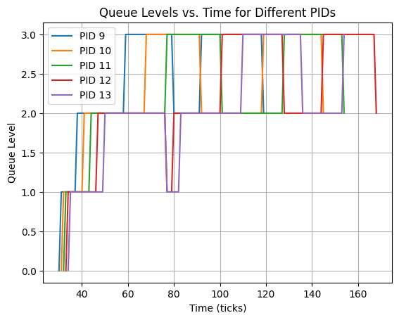

# Comparision between schedulers

| Scheduling Algorithm  | Run Time | Wait Time |
|-----------------------|----------|-----------|
| RR                    | 14       | 156       |
| RR (CPU-3)            | 12       | 111       |
| FCFS                  | 29       | 130       |
| FCFS (CPU-3)          | 29       | 34        |
| MLFQ                  | 14       | 151       |

 
 
 

---
# The MLFQ Graph

 
 
 

---

# Implementation of and FCFS

    for (;;)
    {
        struct proc *min_time_proc = proc;
        intr_on(); // Enable interrupts to avoid deadlock

        int min_creationTime = __INT32_MAX__;
        // Find the process with the minimum creation time that is runnable
        for (p = proc; p < &proc[NPROC]; p++)
        {
        if ((p->state == RUNNABLE) && (p->ctime < min_creationTime)) // If the process is runnable and has a lower creation time
        {
            min_time_proc = p;
            min_creationTime = p->ctime;
        }
        }
        // min_time_proc contains the process with the minimum creation time that is runnable
        // min contains the minimum creation time

        acquire(&min_time_proc->lock);
        p = min_time_proc;
        if (p->state == RUNNABLE)
        {
        p->state = RUNNING;              // Change the state of the process to running
        c->proc = p;                     // Set the current process to the process with the minimum creation time
        swtch(&c->context, &p->context); // Switch to the process with the minimum creation time

        // Set the current process to 0 since the process has finished running therefore it is not the current process anymore
        c->proc = 0;
        }
        release(&p->lock);
    }

# Implemenetation of MLFQ

    for (;;)
    {
        struct proc *min_time_proc = proc;
        intr_on(); // Enable interrupts to avoid deadlock

        int min_creationTime = __INT32_MAX__;
        // Find the process with the minimum creation time that is runnable
        for (p = proc; p < &proc[NPROC]; p++)
        {
        if ((p->state == RUNNABLE) && (p->ctime < min_creationTime)) // If the process is runnable and has a lower creation time
        {
            min_time_proc = p;
            min_creationTime = p->ctime;
        }
        }
        // min_time_proc contains the process with the minimum creation time that is runnable
        // min contains the minimum creation time

        acquire(&min_time_proc->lock);
        p = min_time_proc;
        if (p->state == RUNNABLE)
        {
        p->state = RUNNING;              // Change the state of the process to running
        c->proc = p;                     // Set the current process to the process with the minimum creation time
        swtch(&c->context, &p->context); // Switch to the process with the minimum creation time

        // Set the current process to 0 since the process has finished running therefore it is not the current process anymore
        c->proc = 0;
        }
        release(&p->lock);
    }
    #elif defined(MLFQ)
    printf("MLFQ has been chosen as the scheduler for the OS\n");
    for (;;)
    {
        // Avoid deadlock by ensuring that devices can interrupt.
        intr_on(); // Enable interrupts to avoid deadlock

        // Aging of the process
        for (p = proc; p < &proc[NPROC]; p++) // Iterate through all processes
        {
        if (p->state == RUNNABLE && (ticks - (p->entry_time)) >= 30) // If the process is runnable and has been in the queue for more than 128 ticks
        {
            if (p->check_interval == 1) // If the process is in the queue
            {
            delete (&(Queue[p->level].head), p->pid); // Delete the process from the queue
            Queue[p->level].curr_size--;              // Decrement the size of the queue
            p->check_interval = 0;                    // Set the check interval to 0
            }
            if (p->level) // If the process is not in the highest queue
            {
            // printf("%d %d %d\n", p->pid, p->level, ticks - 1);
            p->level--; // Move the process to the higher queue
            // printf("%d %d %d\n", p->pid, p->level, ticks);
            }
            p->entry_time = ticks; // Update the entry time of the process
        }
        }

        // Enqueue runnable processes
        for (p = proc; p < &proc[NPROC]; p++) //  Iterate through all processes again to find runnable processes
        {
        if (p->state == RUNNABLE && p->check_interval == 0)
        {
            enqueue(&(Queue[p->level].head), p); // Enqueue the process to the queue
            Queue[p->level].curr_size++;         // Increment the size of the queue
            p->check_interval = 1;               // Set the check interval to 1
        }
        }

        // Find the next process to run
        int flag = 0;                           // Flag to check if a process has been found
        for (int q_lev = 0; q_lev < 4; q_lev++) // Iterate through all queues
        {
        while (Queue[q_lev].curr_size)
        {
            p = front(&(Queue[q_lev].head)); // Get the front process in the queue
            dequeue(&(Queue[q_lev].head));   // Dequeue the front process in the queue
            Queue[q_lev].curr_size--;        // Decrement the size of the queue
            p->check_interval = 0;           // Set the check interval to 0
            if (p->state == RUNNABLE)
            {
            p->entry_time = ticks; // Update the entry time of the process
            flag = 1;              // Set the flag to 1
            break;
            }
        }
        // if a process has been found, break out of the loop
        if (flag == 1)
        {
            break;
        }
        }

        if (p == 0) //  If no process has been found
        {
        continue;
        }

        if (p->state == RUNNABLE)
        {
        acquire(&p->lock);
        // Assign time slice based on process level
        int timeslices[] = {1, 3, 9, 15};
        p->timeslice = timeslices[p->level];

        p->state = RUNNING;
        c->proc = p;
        p->entry_time = ticks;
        swtch(&c->context, &p->context);
        c->proc = 0;
        release(&p->lock);
        }
    }

 
 

Following functions have been added for MLFQ

    // Enqueue a process to the queue
    void enqueue(Node **head, struct proc *p)
    {
    Node *newNode = findAvailableNode(); // Find an available node
    newNode->curr_proc = p;
    newNode->next = NULL;

    if (*head == NULL) // If the queue is empty, new node is the head
    {
        *head = newNode;
    }
    else // Otherwise, append to the end of the queue
    {
        appendToQueue(*head, newNode);
    }
    }

    // Remove the front process from the queue
    void dequeue(Node **head)
    {
    if (*head == NULL)
    {
        return;
    }
    Node *temp = *head;
    *head = (*head)->next;
    temp->curr_proc = NULL;
    temp->next = NULL;
    }

    // Find an available node in the process list
    Node *findAvailableNode()
    {
    for (int i = 0; i < NPROC; i++)
    {
        if (processesList[i].curr_proc == NULL)
        {
        return &(processesList[i]);
        }
    }
    return NULL; // No available node found
    }

    // Append a node to the end of the queue
    void appendToQueue(Node *head, Node *newNode)
    {
    Node *current = head;
    while (current->next != NULL)
    {
        current = current->next;
    }
    current->next = newNode;
    }

    // Get the front process of the queue without removing it
    struct proc *front(Node **head)
    {
    if (*head == NULL)
    {
        return NULL;
    }
    return (*head)->curr_proc; // Return the front process
    }

    // Delete a process with a specific PID from the queue
    void delete(Node **head, uint pid)
    {
    if (*head == NULL)
    {
        return;
    }
    if ((*head)->curr_proc->pid == pid)
    {
        Node *temp = *head;
        *head = (*head)->next;
        temp->curr_proc = NULL;
        temp->next = NULL;
        return;
    }

    Node *current = *head;
    while (current->next != NULL && current->next->curr_proc->pid != pid)
    {
        current = current->next;
    }

    if (current->next != NULL) // PID found
    {
        Node *temp = current->next;
        current->next = current->next->next;
        temp->curr_proc = NULL;
        temp->next = NULL;
    }
    }

 
The following code has been added in the `usertrap` function in the `trap.c` file
 

    // Check if the current process exists and is in a RUNNING state
    if (myproc() && myproc()->state == RUNNING)
    {
        struct proc *p = myproc(); // Get the current process

        // Check if the process has exhausted its timeslice
        if (p->timeslice <= 0) 
        {
            // Check if the process is not in the last queue
            if (p->level < 3) 
            {
                // printf("%d %d %d\n", p->pid, p->level,  ticks - 1);
                p->level++; // Move the process to the next queue
                // printf("%d %d %d\n", p->pid, p->level, ticks);

                yield();    // Relinquish the processor
            }
        }
    }

---
**Other small tweaks around the code have been made to make it work with the new schedulers but these are the major implementations.**
